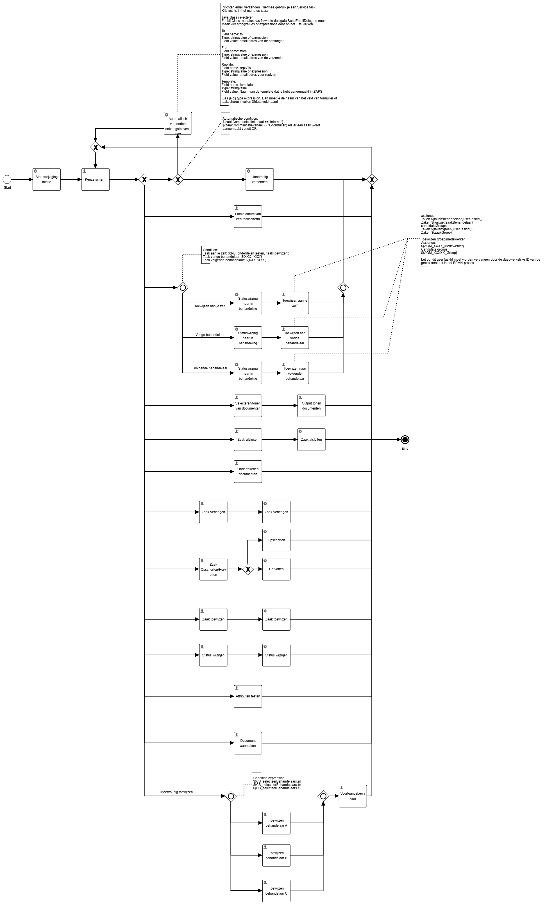

# End-to-End testproces E2E (Werkgroep ZAC BPMN)

Het End-to-End testproces is gemaakt door de werkgroep ZAC BPMN en kan gebruikt worden om de functionaliteiten van ZAC te testen. Bijvoorbeeld na een update.  
In de map vind je het proces dat gemaakt is in Flowable. Ook de bijbehorende taakschermen, gemaakt op basis van Form.io, vind je hier.

🚧 Dit proces is getest op ZAC versie 4.5.33 🚧

## Preview procesflow

